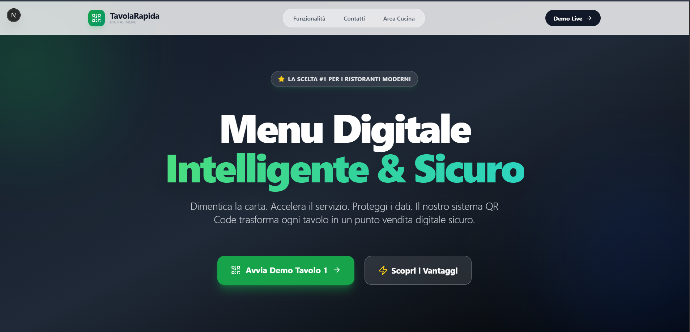
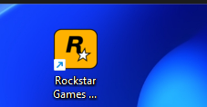

# M2M - Modern Management (Ristorante)

**Sistema full-stack realtime per la gestione digitale di ristoranti moderni**


---

## 🎯 Overview del Progetto

M2M è una piattaforma web progettata per digitalizzare e ottimizzare la gestione operativa di un ristorante, sostituendo processi manuali (carta, comande tradizionali) con un sistema **centralizzato, realtime e multi-dispositivo**.

Il sistema permette la gestione simultanea di tavoli, ordini e sala, sincronizzando ogni modifica in tempo reale tra camerieri e amministratori.

L’obiettivo non è solo la gestione, ma la simulazione di un ambiente reale di ristorazione con logiche di comunicazione event-driven.

---

## ⚙️ Architettura del Sistema

Il progetto è basato su un’architettura **full-stack moderna event-driven**:

- Frontend Next.js (App Router) → interfaccia operativa per staff e admin  
- Backend Supabase → database + autenticazione + realtime  
- State Layer (Zustand) → gestione locale del carrello e tavoli  
- Server Actions → operazioni sicure lato server  
- Realtime Engine → sincronizzazione immediata tra dispositivi  

💡 Ogni azione (ordine, apertura tavolo, modifica menu) viene propagata in tempo reale a tutti i client connessi.

---

## ✨ Funzionalità

### 👨‍🍳 Area Camerieri
- Mappa interattiva della sala con stato tavoli
- Apertura e gestione tavolo in tempo reale
- Creazione ordini con sistema a carrello
- Aggiunta note personalizzate per ogni piatto
- Aggiornamenti live senza refresh pagina

### 👨‍💼 Area Amministratore
- Gestione completa del menu (categorie e piatti)
- Gestione utenti con ruoli (admin / staff)
- Monitoraggio ordini attivi e completati
- Dashboard con panoramica operativa
- Controllo stato tavoli in tempo reale

### ⚡ Funzionalità Tecniche
- Autenticazione sicura con Supabase Auth
- Aggiornamenti realtime multi-dispositivo
- UI responsive ottimizzata per tablet e mobile
- Validazione dati con Zod
- Architettura modulare e scalabile

---

## 🧠 Tecnologie Utilizzate

| Tecnologia       | Ruolo nel progetto |
|------------------|-------------------|
| Next.js 16       | Frontend + backend (App Router) |
| TypeScript       | Tipizzazione e robustezza |
| Supabase         | Database, auth e realtime |
| Tailwind CSS     | UI moderna e responsive |
| Zustand          | Gestione stato locale |
| Zod              | Validazione dati |
| Lucide React     | Iconografia UI |

---

## 🧩 Modello Dati (semplificato)

- `profiles` → utenti e ruoli sistema  
- `tables` → tavoli del ristorante  
- `orders` → ordini attivi e storici  
- `order_items` → singoli elementi ordine  
- `menu_categories` → categorie menu  
- `menu_items` → piatti e prezzi  

---

## 🖥️ UI & UX

Il sistema è progettato con approccio **mobile-first**, ottimizzato per:

- Tablet per camerieri  
- Desktop per amministrazione  
- Interazioni rapide (zero reload)  
- Feedback visivo immediato  

---

## 📸 Interfaccia

### Home Page


### Mappa Tavoli


### Gestione Ordine


### Dashboard Admin


---

## 🚀 Installazione

```bash
git clone https://github.com/montronechris/m2m.git
cd m2m
npm install
cp .env.example .env.local
npm run dev
📌 Requisiti
Node.js 20 o superiore
Account Supabase attivo
🔐 Configurazione

Per avviare correttamente il progetto è necessario configurare le variabili d’ambiente.

Nel file .env.local inserire:

URL del progetto Supabase
API Key pubblica (anon key)
API Key privata (service role, se richiesta)
Configurazione autenticazione (Auth)
Abilitazione Realtime database

💡 Queste variabili permettono la connessione tra frontend e backend Supabase (database, autenticazione e sincronizzazione in tempo reale).

🧠 Scelte Progettuali

Il progetto è stato sviluppato seguendo principi di ingegneria del software moderna:

Separazione delle responsabilità tra UI, logica e servizi
Architettura scalabile a componenti, facilmente estendibile
Aggiornamenti realtime per ridurre al minimo i refresh della pagina
Gestione dello stato ibrida tra stato locale (Zustand) e backend (Supabase)
Sicurezza lato server tramite Server Actions e controllo accessi

💡 L’obiettivo è simulare un sistema reale utilizzabile in un contesto professionale.

🎓 Competenze Dimostrate

Questo progetto evidenzia competenze concrete nello sviluppo software full-stack:

Sviluppo di applicazioni web moderne end-to-end
Integrazione di database realtime e sistemi event-driven
Progettazione di architetture scalabili e modulari
Sviluppo di interfacce UI/UX orientate all’utilizzo reale
Gestione di autenticazione, ruoli e permessi
Strutturazione di codice mantenibile e professionale
📈 Possibili Evoluzioni

Il progetto è pensato come base estendibile. Possibili sviluppi futuri includono:

Integrazione di sistemi di pagamento digitali
Supporto a stampanti fiscali e termiche
Dashboard avanzate con analytics e KPI
Modalità offline tramite PWA
Integrazione di AI per suggerimenti menu intelligenti
Sistema completo di gestione magazzino e ingredienti
🧾 Nota finale

Questo progetto è stato sviluppato come capolavoro finale del percorso scolastico, con l’obiettivo di dimostrare capacità avanzate in:

sviluppo di applicazioni reali
progettazione di architetture moderne
utilizzo di tecnologie full-stack attuali
attenzione all’esperienza utente e alle performance

Autore: [Il Tuo Nome]
Anno: 2026
